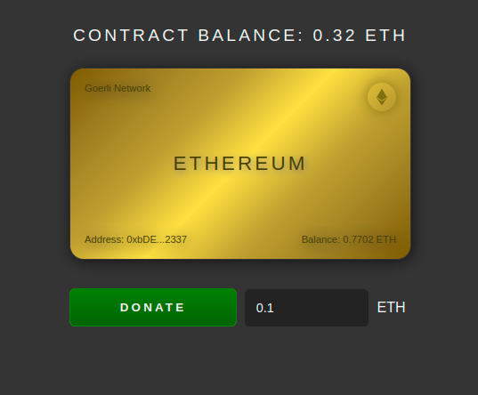

# Donate Crypto UI

Simple Dapp for donating ETH

## Screenshots

## Prerequisites

Install [Git](https://git-scm.com/book/en/v2/Getting-Started-Installing-Git), the free and open source distributed Version Control System  
Install [Node.js](https://nodejs.org/) which includes Node Package Manager  
Install [Yarn](https://yarnpkg.com) Package Manager  

## Clone and Install

Run `git clone https://github.com/orbanszlrd/donate-crypto-ui.git` to clone te project from [GitHub](https://github.com/orbanszlrd/donate-crypto-ui)  
Run `yarn install` or `npm install` to install the dependencies  

## Development Server

Run `yarn dev` or `npm run dev` to start the development server  

## Build the Project

Run `yarn build` or `npm run build` to build the project  

## Further help

[React - A JavaScript library for building user interfaces](https://reactjs.org/)  
[Vite - Next Generation Frontend Tooling](https://vitejs.dev/)  
[Ethereum - Technology powering the Cryptocurrency Ether](https://ethereum.org/)  
[Etherscan - The Ethereum Blockchain Explorer](https://etherscan.io/)  
[Remix - Ethereum IDE](https://remix.ethereum.org/)  
[Solidity - Programming Language for implementing Smart Contracts](https://docs.soliditylang.org/)  
[Ganache - Personal Blockchain for Ethereum development](https://trufflesuite.com/ganache/)  
[ethers.js - Library for interacting with the Ethereum Blockchain](https://docs.ethers.io/)  
[web3.js - Ethereum JavaScript API](https://web3js.readthedocs.io/)  
[Hardhat - Ethereum Development Environment for Professionals](https://hardhat.org/)  
[MetaMask - A Crypto Wallet & Gateway to Blockchain Apps](https://metamask.io/)  
[MetaMask Docs - Getting Started](https://docs.metamask.io)  
[Alchemy - The Web3 Development Platform](https://alchemy.com/?r=7b980bb14402be0b)  
[Goerli Faucet - Get 0.5 Goerli ETH / day](https://goerlifaucet.com/)  
[Chainlink - Securely connect Smart Contracts with off-chain Data and Services](https://chain.link/)  
[Chainlink Faucet - Request testnet LINK](https://faucets.chain.link/)  
